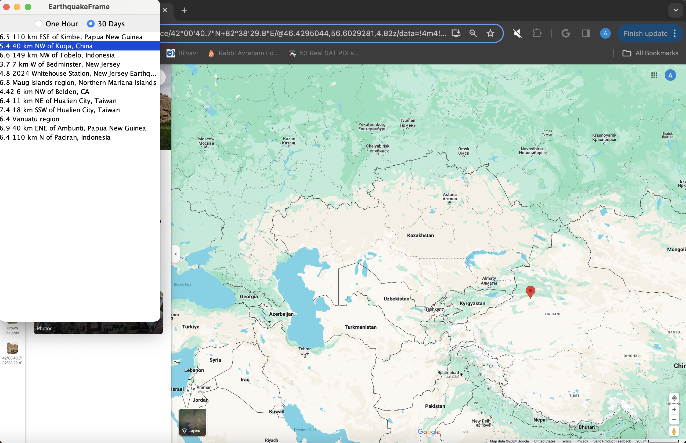
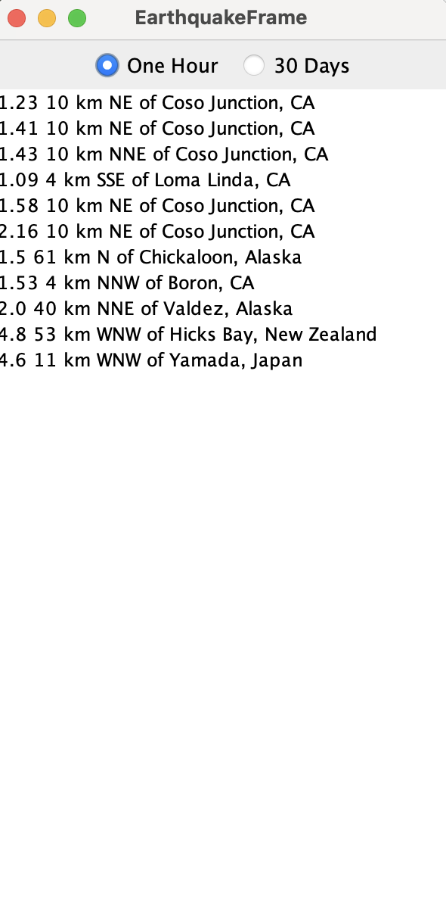

# Earthquake Project

This program connects to USGS Earthquake Data and displays either all the 
earthquakes that took place in the last hour or the strongest earthquakes of the past month.
When the user clicks on an earthquake, a Google Maps link opens with the location the
earthquake took place in.

### Technology
[Earthquake JSON and API](https://earthquake.usgs.gov/earthquakes/feed/v1.0/geojson.php)